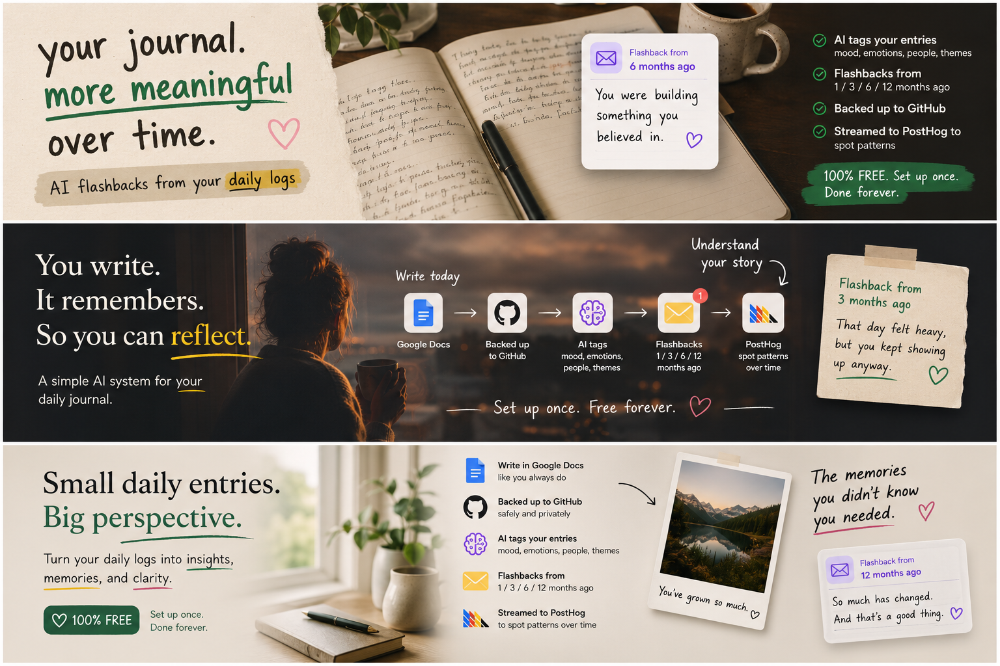

# daily-logs-sync



A small automation that turns your daily Google Docs journal entries into something more useful. Every entry gets backed up to GitHub, tagged by AI for mood, emotions, people, and themes, emailed back to you as flashbacks from 1 / 3 / 6 / 12 months ago like Google Photos memories, and streamed to PostHog so you can notice interesting patterns from your journaling.

You simply keep writing the way you already do. The system just needs to be set up once, and is completely free of cost.

▶️ **[Watch the video walkthrough](https://youtu.be/N4JE-jT3VMM)**

## What it does

- Reads your daily journal entries from a Google Doc (one Doc per month, one tab per day)
- Converts each entry to clean markdown
- Tags it via an LLM (mood, emotions, people, activities, themes, one-line summary)
- Pushes it to a private GitHub repo as `YYYY/MM/YYYY-MM-DD--slug.md` with YAML frontmatter
- Emails you periodic "echoes" of what you wrote 1 / 3 / 6 / 12 months ago, with LLM-generated highlights
- Sends a `daily_log` event per entry to PostHog so you can build mood/emotion/activity dashboards
- Optionally writes a sentiment HTML chart back into the same repo (`reports/sentiment.html`)

## Main features

- **De-duplicated sync** — re-running never duplicates GitHub commits or PostHog events
- **Backfill** — process every Doc you already have, or backfill all existing entries into PostHog as historical events
- **LLM-tagged frontmatter** — structured `mood`, `emotions`, `emotion_scores`, `people`, `activities`, `themes`, `summary` using a free API call via Ollama
- **Email echoes** — periodic digest of past-self entries with LLM highlights
- **Free PostHog events** — rich properties (date parts, day-of-week, weekend flag, dominant emotion, counts) ready for HogQL
- **Self-hosted, no servers** — runs entirely on Google Apps Script's free time-based triggers

## Architecture

```
Google Doc (monthly)
    │
    ▼
Apps Script
    │
    ├──► Your private GitHub repo  (markdown + frontmatter)
    │       │
    │       └──► sentiment.html report
    │
    ├──► Gmail (echo digests)
    │
    └──► PostHog  (daily_log events)
```

> This repo holds the script + setup docs for reference. Your journal entries live in a separate **private** GitHub repo that you create and own.

## Getting started

You need a Google account. GitHub, an LLM API key, and PostHog are each optional — the script soft-skips any integration whose key isn't set.

### 1. Create the Apps Script project

1. Open [script.google.com](https://script.google.com) → **New project**
2. Replace the `Code.gs` content with [`apps-script.gs`](./apps-script.gs) from this repo
3. Save

### 2. Configure variables (not secrets — edit in code)

Inside the Apps Script editor, open the `Code.gs` file you just pasted into. The first 20-ish lines are a `// ===== CONFIG =====` block. These are plain configuration values, **not secrets** — edit them directly in the editor (don't add them as Script Properties), then **Save** (`Cmd/Ctrl + S`).

| Variable | What | Default |
|---|---|---|
| `GITHUB_OWNER` | Your GitHub username | `'USERNAME'` |
| `GITHUB_REPO` | Repo to sync into | `'daily-logs'` |
| `GITHUB_BRANCH` | Branch | `'main'` |
| `POSTHOG_HOST` | `us.i.posthog.com` or `eu.i.posthog.com` | US |
| `POSTHOG_EVENT_NAME` | Event name in PostHog (e.g. `'daily_log'`) | `'EVENT_NAME'` |
| `LLM_MODEL` | Any Ollama Cloud model — free, [pick from the model list](https://ollama.com/search?c=cloud) | `'gemma4:31b-cloud'` |
| `ECHO_INTERVAL_DAYS` | Days between echo emails | `4` |
| `ECHO_ANCHORS_MONTHS` | Months-ago to echo | `[1, 3, 6, 12]` |

> Secrets (API keys/tokens) go in **Script Properties** — see Step 3. Everything in this table is hardcoded in `Code.gs` and ignored if added as Script Properties.

Echoes email goes to the Google account running the script. Override by editing `recipient` in `echoesDigest`.

### 3. Set secrets (Script Properties)

In Apps Script: **Project Settings** (gear icon) → **Script properties** → add the ones you want.

| Property | Required for | How to get |
|---|---|---|
| `GITHUB_TOKEN` | GitHub sync | [Create a fine-grained token](https://github.com/settings/personal-access-tokens/new) with `Contents: read & write` scope on your target repo |
| `OLLAMA_API_KEY` | LLM tagging + echoes highlights | Free — [ollama.com](https://ollama.com) → sign up → **API keys**. Several cloud models available; swap via `LLM_MODEL` |
| `POSTHOG_API_KEY` | PostHog events | [Project settings → Project API key](https://posthog.com/docs/api#how-to-find-your-api-key) |

If you skip any of these, the script just won't run that integration. GitHub-less mode still tags and emails. PostHog-less mode still pushes to GitHub.

### 4. Set up your Google Doc

The script needs a specific naming convention to pick up dates correctly.

**Doc name** — exactly `Mmm daily log YYYY`. Three-letter month, lowercase "daily log", four-digit year.

✅ `May daily log 2026`
✅ `Dec daily log 2025`
❌ `May 2026 logs` · `daily log May 2026` · `May daily log` (no year)

**Year** comes from the Doc name. **Month + day** come from the tab title.

**Tab title** — must contain a month + day, anywhere in the title. The script matches:

```
(Jan|Feb|...|Dec OR January|February|...|December) <day>
```

✅ `May 12 - Coffee with Alex` → May 12
✅ `May 12` → May 12
✅ `Tuesday, May 12 — gym day` → May 12
✅ `May 12: trip planning` → May 12
❌ `12 - some title` (no month name)
❌ `05/12 - notes` (numeric date)
❌ `journal entry` (no date at all — skipped silently)

**Filename slug** — what comes after the date prefix (`Mmm DD - `, `Mmm DD: `, etc.) becomes the slug. So tab title `May 12 - Coffee with Alex` → file `2026/05/2026-05-12--coffee-with-alex.md`.

**Nested tabs** — supported. If you organize by week or theme inside a month Doc, child tabs get flattened and parsed the same way.

Already have Docs in a different format? Rename them, or edit `findAllLogDocs_` (Doc-name regex, line ~206) and `parseDateFromTitle_` (tab-title regex, line ~252) to match yours.

### 5. Authorize and test

In the Apps Script editor:

1. Select function `testAuth` from the dropdown → **Run** → grant permissions on first run
2. Check **Execution log** — should print `GitHub: 200` and `LLM key set: yes`
3. Run `dailyRun` to sync yesterday's tab, or `backfillAll` to process every Doc you have

### 6. Install triggers (so it runs itself)

Run these once each from the Apps Script editor:

- `installDailyTrigger` — `dailyRun` every day at 9am
- `installEchoesTrigger` — `echoesDigest` every 4 days at 8am
- `installSentimentTrigger` — `generateSentimentReport` every Sunday at 2am (optional; needs GitHub)

### 7. Backfill PostHog (optional, one-off)

If you already have months of synced markdown and want them as PostHog events:

```
Run function: backfillPosthog
```

This walks the GitHub repo, builds an event per file with the original date as the timestamp, and ships them in batches. UUIDs are deterministic from file paths, so re-running is safe — PostHog dedupes.

## Optional integrations

| Integration | Skip by | Effect |
|---|---|---|
| **GitHub** | Not setting `GITHUB_TOKEN` | Script can't function — GitHub is the storage layer |
| **LLM tagging** | Not setting `OLLAMA_API_KEY` | Entries push with no frontmatter; echoes have no highlights |
| **PostHog** | Not setting `POSTHOG_API_KEY` | No events emitted; everything else works |
| **Echoes email** | Don't run `installEchoesTrigger` | No digests sent |
| **Sentiment report** | Don't run `installSentimentTrigger` | No `reports/sentiment.html` |

## Entry points

| Function | When |
|---|---|
| `testAuth` | Sanity-check GitHub + LLM key |
| `dailyRun` | Process yesterday's entry (triggered daily) |
| `backfillAll` | Re-process every Doc you have |
| `echoesDigest` | Send the echoes email (triggered every 4 days) |
| `backfillPosthog` | One-off: push every existing markdown file to PostHog |
| `generateSentimentReport` | Rebuild `reports/sentiment.html` (triggered weekly) |

## Frontmatter shape

Each synced markdown file starts with:

```yaml
---
date: 2026-05-12
mood: 7
emotions: [curious, productive, peace]
emotion_scores:
  curious: 8
  productive: 7
  peace: 6
people: [alex, sam]
activities: [coding, walk, reading]
themes: [side-projects, focus]
summary: Built the sync pipeline end-to-end and went for an evening walk.
---
```

## Notes

- All PostHog events get a deterministic UUID per file, so backfills and re-runs never create duplicates.
- The LLM prompt asks for strict JSON output. If your model drifts, swap `LLM_MODEL` for another free Ollama Cloud model ([model list](https://ollama.com/search?c=cloud)).
- The Apps Script trigger UI only shows "Daily" — interval-based triggers like "every 4 days" exist programmatically but the UI rounds them visually. Use the `installEchoesTrigger` function to set them; don't recreate via the UI.

## Built by

[sidjainn](https://github.com/sidjainn) — [sidjainn.github.io](https://sidjainn.github.io)
